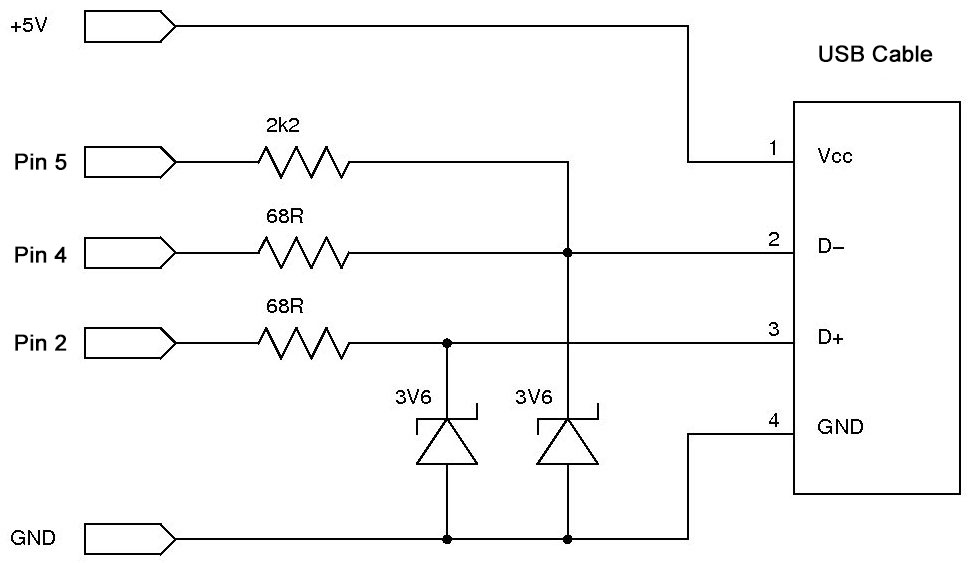

# absolute-mouse


Library to use Arduino UNO as USB mouse or stylus, using absolute positioning. Based on Obdev's VUSB driver, via [UsbMouse](https://github.com/meirm/UsbMouse)

### What is absolute positioning?
If you were to give your friend directions to your house:
 * Absolute Positioning - "My address is 32 Harris St"
 * Relative Positioning - "Drive 2km south, my house will be on the left"

This library uses absolute co-ordinates. <br />

`click(30, 0)` could mean click "30 pixels" from left of screen. It could also mean "30mm" or "30%" depending on your config. See [Screen Dimensions](#screen-dimensions)

If your application calls for Relative Positioning, I can recommend [glaukon-ariston's fork of UsbMouse](https://github.com/glaukon-ariston/UsbMouse)

---

## Wiring
This library makes use of Obdev's VUSB driver. The suggested wiring for Arduino UNO is as follows:



You will get away with some deviation here (resistor values, level shifting alternatives); just remember that the D+ / D- lines will be **very** unhappy if they start to see much more than 3.3V

---

## Using the library
**You must define whether AbsoluteMouse should emulate a mouse or a stylus.**

This should be done at the top of your sketch, before you import the library. Both modes have their own benefits and limitations.
Devices may respond best to one mode in particular: If you're having
issues, try the other mode.

```cpp
#define USE_MOUSE
//#define USE_STYLUS

#include <absolute-mouse.h>

void setup() {
    AbsoluteMouse.begin();
    AbsoluteMouse.click(50, 50);    //Middle of screen
}
```
### Screen Dimensions
By default, absolute-mouse interprets co-ordinates as "percentages" (as in above example). You are encouraged to adjust this to suit your needs, by either:

```cpp
// Passing your dimensions during setup, or
AbsoluteMouse.begin(1440, 900);

// Setting them manually when appropriate
AbsoluteMouse.set_dimensions(1440, 900);
```
You are free to define any width and height, so long as each value is less than 32768.
Consider setting dimensions to your screen's width in mm: 

```cpp
AbsoluteMouse.set_dimensions(310, 175);
```

### Right & Bottom

Negative coordinates are intepretted as offset from the opposite edge. This just makes life easier sometimes.
```cpp
// Screen is 310mm wide, 175mm tall
AbsoluteMouse.set_dimensions(310, 175);

// Click 5mm from left, 10mm up from bottom
// (Aka Windows 10 Start Menu)
AbsoluteMouse.click(5, -10)
```

Available commands vary slightly depending or whether you `#define USE_MOUSE` or `#define USE_STYLUS`. For a full list of commands, see [here](https://github.com/todd-herbert/absolute-mouse/tree/main/doc/function_list/), or consult the `help` command in the DevKit terminal.

---

## DevKit Sketch
Determining the correct command and position for each mouse operation can be a tiresome task. To reduce this burden, the library comes bundled with a DevKit sketch. You will find this with the rest of the examples.

Flash the sketch to your UNO and open a serial monitor (9600 baud) to access a commandline for executing absolute-mouse commands.

**Note: 5V should not be connected to target device when using DevKit.** <br />
[Find out more](doc/self-powered/warning.md)

---

## Installation

Arduino: Library can be installed to Arduino IDE with Sketch -> Include Library -> Add .Zip Library.., or through the built-in Library Manager.

[Platform.io](https://platformio.org/): Available through the built-in library registiry, or alternatively, can be installed by extracting the Zip file to the lib folder of your project.
